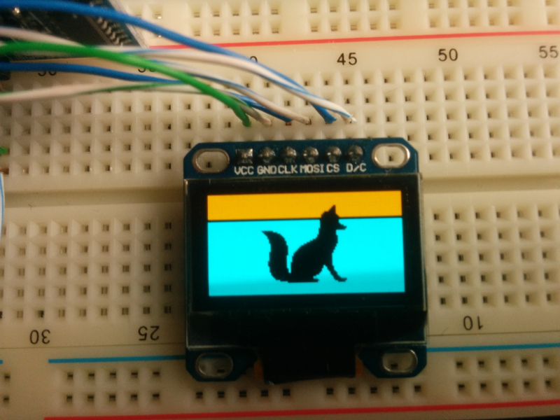
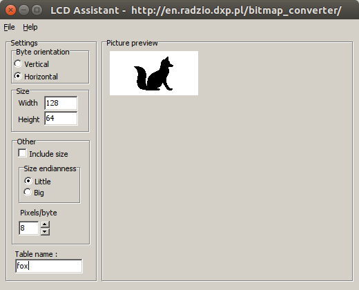

# OLED-demo
Demo application for displaying images and text to a 128x64 size OLED display using SPI to communicate.

## Wiring
OLED display - Arduino Nano
* VCC - 5V
* GND - GND
* CLK - D7
* MOSI - D6
* CS - D5
* D/C - D4

## How to prepare images?
Image size must be 128 x 64 pixels (if you are using 128x64 OLED display).

First, convert image to pure black and white. In Gimp you can use the following commands:
1. Select menu *Image - Mode - Indexed*.
2. Select "*Use black and white (1-bit) palette*" and click "*Convert*".
3. Save image as BMP picture (*File - Export As*, set extension .BMP).

Then run [LCD Assistant]( http://en.radzio.dxp.pl/bitmap_converter/) (can be freely downloaded).
LCD Assistant runs nice in Linux with Wine.

Load BMP image and set:
* Byte orientation: Horizontal
* Width should be 128
* Height should be 64
* Pixels/byte should be 8.

Save output to TXT file and copy picture definition to a variable in INO file.

You can use examples for dog (*dog.bmp* and *dog.txt*) and fox (*fox.bmp* and *fox.txt*).
